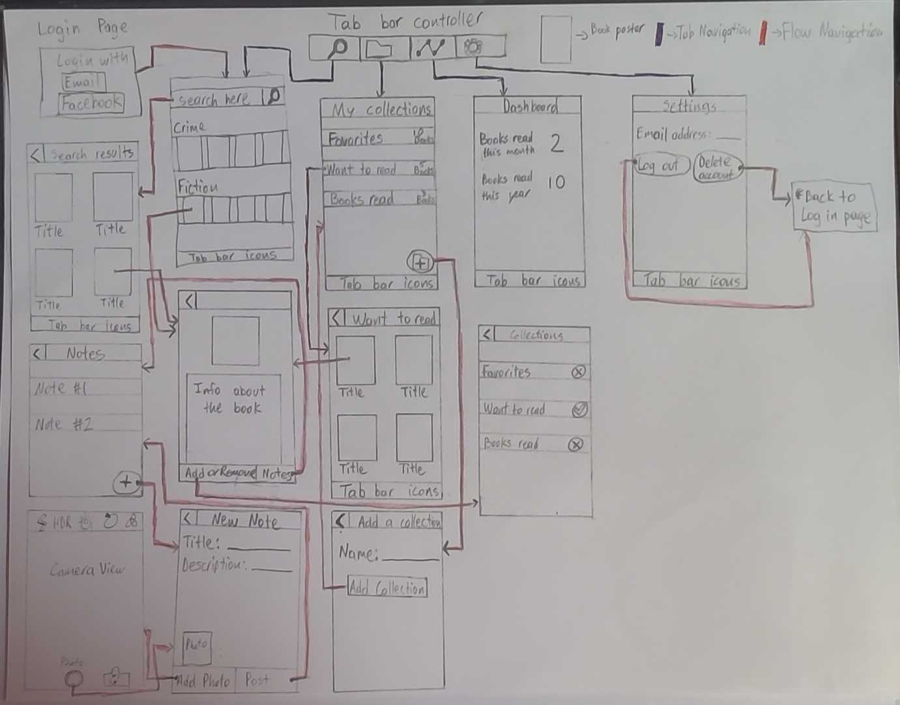

# Milestone 1 - BookIsland

## Table of Contents

1. [Overview](#Overview)
1. [Product Spec](#Product-Spec)
1. [Wireframes](#Wireframes)

## Overview

### Description

[Description of your app]

Link to the file we used for brainstorming application ideas [Link](https://hackmd.io/dHzxx2hHToWoV7U8WVGMxQ) .
### App Evaluation

- **Category:** Education
- **Mobile:** Uses camera in notes to comment about the books.
- **Story:** Allows users to search through a book database and search for their favorite books. They can create their own collection of books and write about what they think of them. 
- **Market:** Any person that likes reading books would be interested in this app.
- **Habit:** Motivate users to spend more time reading books instead of watching tiktok videos and encourage them to keep reading.
- **Scope:** V1 would allow the user to search for books and add them to their collection and place notes on the books them have read or are reading. V2 would allow the user to also take photos in the notes section. V3 would include a dashboard that gives the user information about the time they have spent reading.

## Product Spec

### 1. User Features (Required and Optional)

**Required Features**

* Users can login 
* Users can search books from a database and check for their electronic availability.
* Users can click the button to add books to their collections.
* Users can put notes on the books that they have in their collections.
* Users can take a picture to add it to their notes.
* Settings feature(Email info, username)

**Stretch Features**

* Users can access their reading history in a dashboard.
* Users can share their progress with others.

### 2. Screen Archetypes

- Login Screen
  - Click on the Email Address they want to login
- Search Screen
  - User can search their book
- Collections
  - User can see their book collections
  - User can add new collections
  - Place notes on the books that are addded to their collection.
- Settings
    - User can change their email address
    - Logout from the app
    - Delete their account
### 3. Navigation

**Tab Navigation** (Tab to Screen)

* Search (Main screen)
* Collections
* Dashboard (Stretch feature)
* Settings

**Flow Navigation** (Screen to Screen)

- Search
  - ==> Book list depending on the book or category searched.
  - ==> Click on a specific book for more details
- Collections
  - ==> Create new collection (Create collection activity)
  - ==> Click on a collection for details.
  - ==> In a specific collection, click on a specific book.
  - ==> In a specific book, click "Create Note" (Start create note activity).

- Settings
  - ==> Click on profile settings to change email address
  - ==> Logout/delete account.

## Wireframes

[Add picture of your hand sketched wireframes in this section]

### [BONUS] Digital Wireframes & Mockups

### [BONUS] Interactive Prototype
